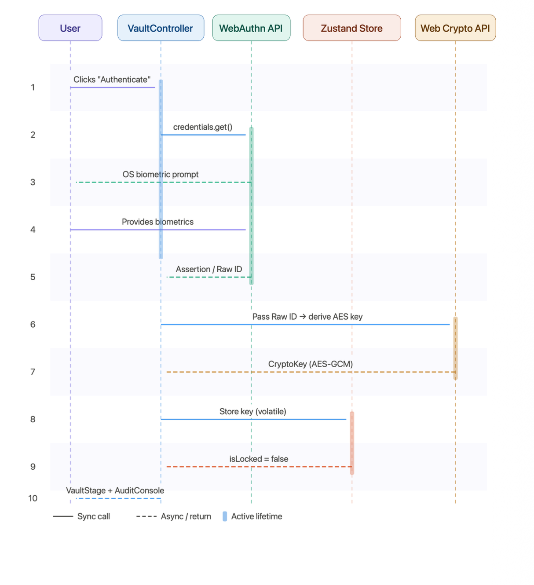
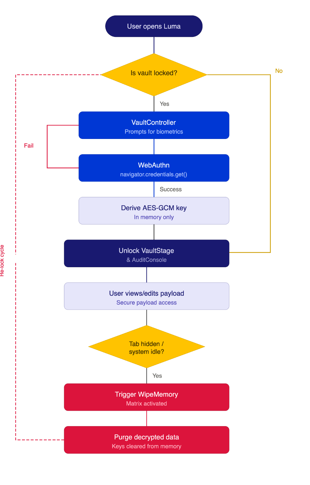

# 2.0 Project Title
Luma - Biometric Authentication Local Lockbox

**Live Demo:** https://luma-five-opal.vercel.app/
**Live Demo (Alternative):** https://kunallubhana77.github.io/luma/

# 2.1 Problem Statement
Managing sensitive text payloads securely without relying on a backend database is challenging. Traditional web applications store secrets on servers or local storage without adequate encryption, leaving them vulnerable to unauthorized access if the device or storage is compromised. There is a need for a highly secure, frontend-only solution that leverages native device biometric hardware to encrypt and decrypt sensitive data purely in volatile memory.

# 2.2 Objectives
- To develop a secure web application that operates entirely without a backend database.
- To utilize the Web Authentication API (WebAuthn) for leveraging built-in device biometrics (Touch ID, Face ID, Windows Hello).
- To implement robust AES-GCM (256-bit) encryption using the Web Crypto API.
- To ensure sensitive data is wiped from volatile memory upon tab visibility loss or idle timeout.
- To provide a premium, minimalist user interface for interacting with encrypted text.

# 2.3 System Overview / Architecture
The architecture of Luma is completely frontend-driven and consists of three main sub-systems:
1. **VaultController:** The master authenticator portal and security deck that initiates WebAuthn biometric challenges.
2. **VaultStage:** The secure text workbench featuring an encrypted payload viewer and a decrypted secret notebook.
3. **AuditConsole:** A local subsystem log tracking real-time cryptographic handshakes and WebAuthn success rates.

The state model maps biometric verification pulses directly to in-memory encryption keys, meaning the system never stores plain text or keys permanently.

<div align="center">
  
</div>

# 2.4 Components and Libraries Used
- **Frontend Framework:** React 19 (via Vite)
- **Styling:** Tailwind CSS (v4)
- **State Management:** Zustand
- **Icons:** lucide-react
- **Authentication:** WebAuthn API (`navigator.credentials.create()`)
- **Encryption:** Web Crypto API (`window.crypto.subtle`, AES-GCM 256-bit)
- **Language:** TypeScript

# 2.5 Implementation Approach
The project is implemented using modern web APIs directly within a React application.
1. **Biometric Binding:** Uses the WebAuthn API to generate hardware-bound asymmetric key pairs upon user authentication.
2. **Encryption Engine:** Text encryption and decryption are handled by the native Web Crypto API (`window.crypto.subtle`), wrapping secrets in AES-GCM 256-bit encryption.
3. **Zero-Database Model:** All encrypted state is stored within local volatile memory and `localStorage`. Keys exist solely in memory.
4. **Auto-Locking Memory Wipe Matrix:** An event listener monitors `visibilitychange` and idle time. If the user switches tabs or is idle, the decrypted strings and cryptographic keys are forcefully purged from memory, automatically re-locking the application.

<div align="center">
  
</div>

# 2.6 Performance Analysis
- **Execution Speed:** Leveraging native C++ implementations within the browser for Web Crypto API ensures near-instantaneous encryption and decryption of standard text payloads.
- **Resource Usage:** Zero backend dependency removes network latency associated with authentication, reducing the overall time-to-interactivity.
- **Memory Footprint:** The application operates strictly within volatile memory, avoiding storage bloat, with automatic garbage collection of sensitive variables when the memory wipe matrix is triggered.

# 2.7 Execution Steps
To execute the project locally:

1. **Prerequisites:** Ensure Node.js (v18+) is installed and use a modern browser supporting WebAuthn (Chrome, Safari, Edge).
2. **Clone the repository:**
   ```bash
   git clone https://github.com/Kunallubhana77/luma.git
   cd luma
   ```
3. **Install dependencies:**
   ```bash
   npm install
   ```
4. **Run the development server:**
   ```bash
   npm run dev
   ```
5. **Open in Browser:** Navigate to `http://localhost:5173`.
   *Note: The application must be run on `localhost` or served via HTTPS to allow the WebAuthn API to interface with the operating system's biometric hardware.*

# 2.8 Sample Inputs and Outputs
- **Input:** A plain-text string (e.g., "My Secret Password 123").
- **Process:** The user initiates a biometric scan (Touch ID / Windows Hello).
- **Output:** An AES-GCM encrypted cipher-text array, stored locally. Upon successful subsequent biometric verification, the output returns the original "My Secret Password 123".

# 2.9 Screenshots
<div align="center">
  
  
  
</div>

# 2.10 Results and Observations
- The integration of WebAuthn allows for passwordless, high-security access.
- AES-GCM successfully wraps text such that it cannot be retrieved without a fresh biometric authentication pulse.
- The Auto-Locking Memory Wipe reliably triggers upon tab backgrounding, protecting secrets from lingering on unattended screens.
- The UI maintains a smooth 60fps experience due to efficient React state updates via Zustand and Tailwind CSS.

# 2.11 Conclusion
Luma successfully demonstrates that modern web browsers possess the native cryptographic and biometric capabilities required to build highly secure, zero-database applications. By strictly isolating sensitive data within volatile memory and enforcing biometric-only access, it provides an effective local lockbox for sensitive information without exposing data to network vulnerabilities.
