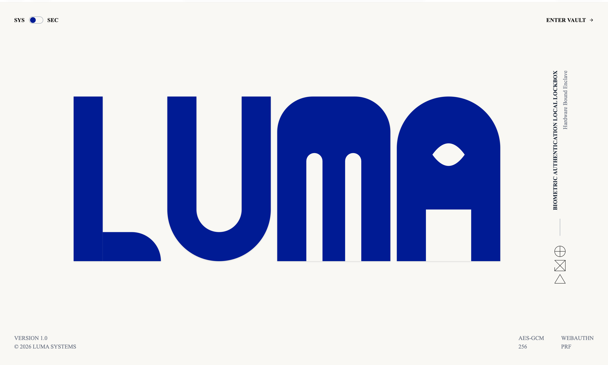
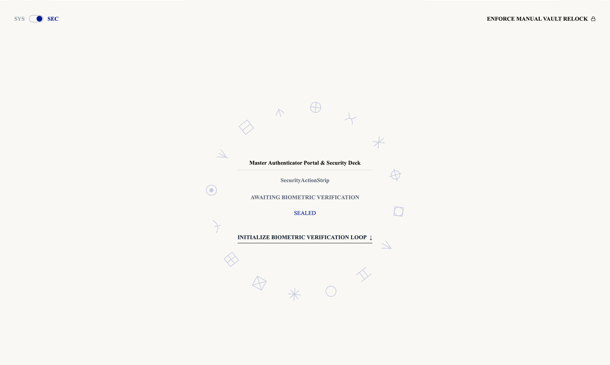
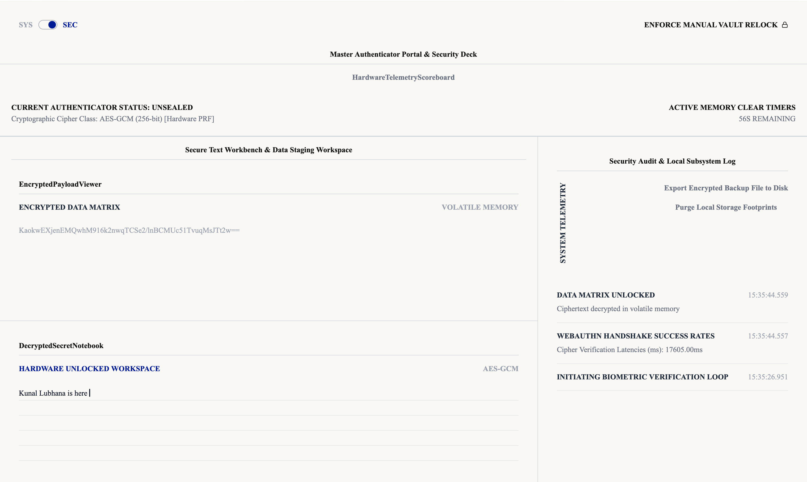

# Luma - Biometric Authentication Local Lockbox

**Live Demo:** [https://luma-luz53m3qo-kunallubhana77s-projects.vercel.app](https://luma-luz53m3qo-kunallubhana77s-projects.vercel.app)

## 📖 Project Description
A highly secure, frontend-only ReactJS web application that leverages the **Web Authentication API (WebAuthn)** to lock and unlock sensitive text payloads using your device's built-in biometric sensors (Touch ID / Face ID / Windows Hello).

This project operates entirely within local volatile memory and `localStorage` using **AES-GCM (256-bit)** encryption, completely eliminating the need for a backend database. 

## 🚀 Tech Stack
- **Frontend Framework:** React 19 (via Vite)
- **Styling:** Tailwind CSS (v4)
- **State Management:** Zustand
- **Authentication:** WebAuthn API (Native Device Biometrics)
- **Encryption:** Web Crypto API (AES-GCM 256-bit)
- **Language:** TypeScript

## ✨ Features
- **Zero-Database State Model:** Maps biometric verification pulses directly to in-memory encryption keys.
- **WebAuthn Integration:** Uses `navigator.credentials.create()` to generate hardware-bound asymmetric key pairs.
- **AES-GCM Encryption Engine:** Wraps and unwraps text using `window.crypto.subtle` natively in the browser.
- **Auto-Locking Memory Wipe Matrix:** Automatically purges all decrypted strings from memory upon tab visibility loss or idle timeouts.
- **Minimalist Premium Design:** Strict minimalist typography conforming precisely to premium design standards.

## 📸 Screenshots

<div align="center">
  
  
  
</div>

## 🛠️ Setup Instructions

Another developer can easily run this project locally without any complex backend setup.

### Prerequisites
- Node.js (v18 or higher recommended)
- A modern browser supporting WebAuthn API (Chrome, Safari, Edge, Firefox)

### Installation Steps

1. **Clone the repository**
   ```bash
   git clone https://github.com/Kunallubhana77/luma.git
   cd luma
   ```

2. **Install dependencies**
   ```bash
   npm install
   ```

3. **Run the development server**
   ```bash
   npm run dev
   ```

4. **Open in Browser**
   Open your browser and navigate to the local URL provided by Vite (usually `http://localhost:5173`).
   
*Note: The application must be run on `localhost` or served via HTTPS to allow the WebAuthn API to interface with the operating system's biometric hardware.*

## 🏗️ Architecture
1. **VaultController:** The master authenticator portal and security deck.
2. **VaultStage:** The secure text workbench featuring an encrypted payload viewer and a decrypted secret notebook.
3. **AuditConsole:** A local subsystem log tracking real-time cryptographic handshakes and WebAuthn success rates.
